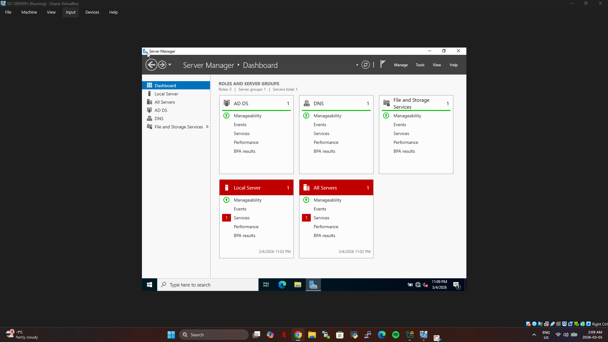
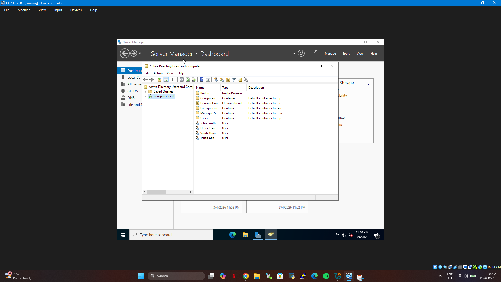
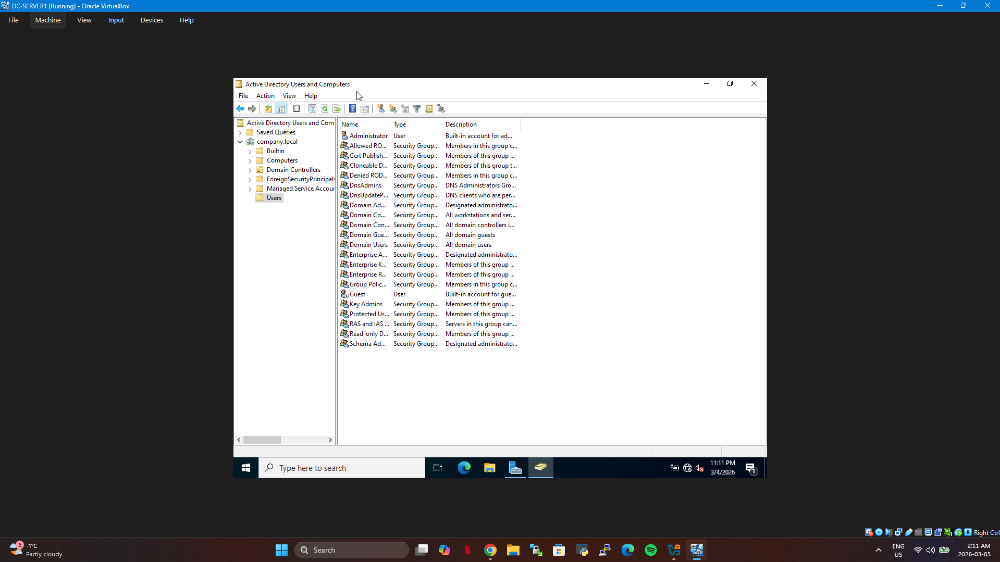
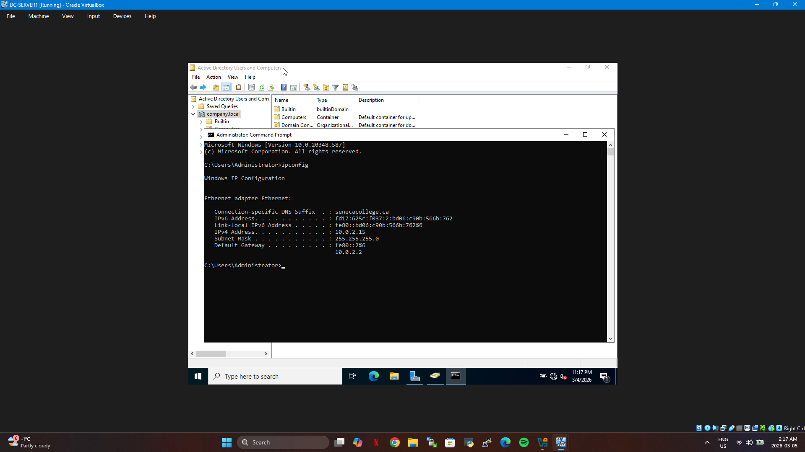
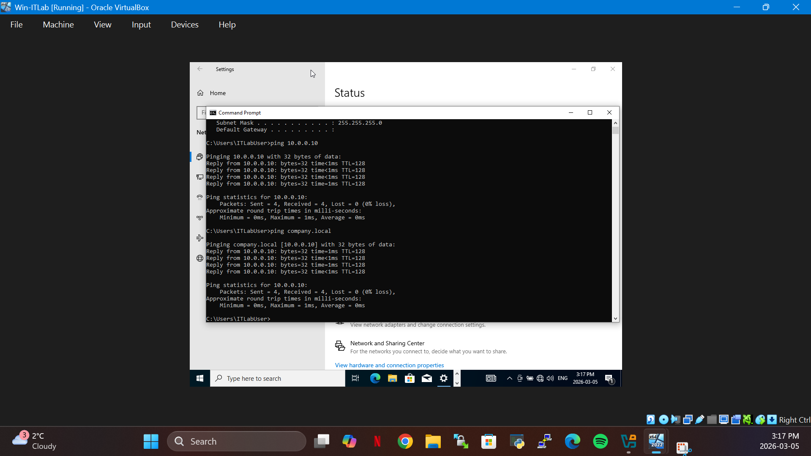
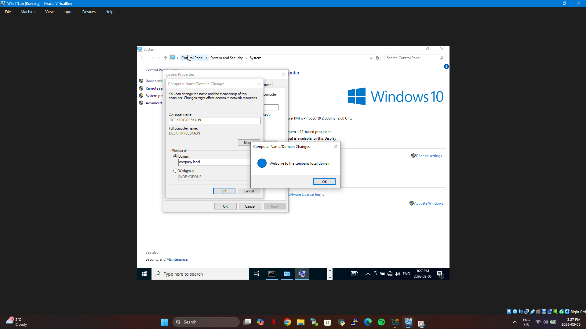
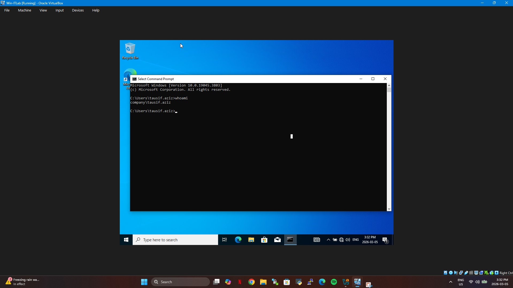
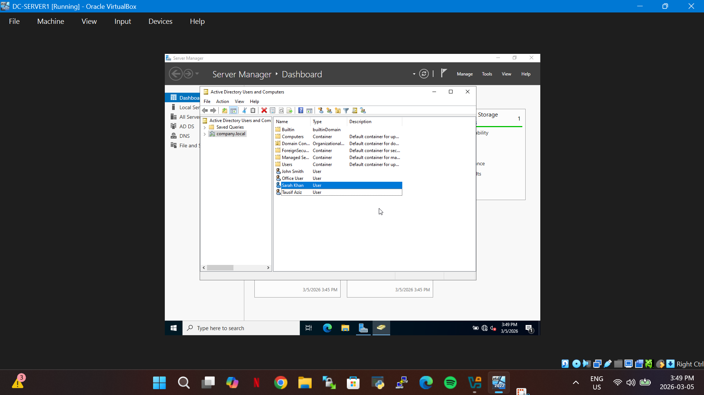

# Active Directory Enterprise Lab

This project demonstrates the deployment of a small enterprise network environment using Active Directory.

## Technologies
- Windows Server 2022
- Active Directory Domain Services
- DNS
- Windows 10 Client
- Oracle VM VirtualBox

## Project Overview
A domain controller was configured using Windows Server 2022. A Windows 10 client machine was joined to the domain and authentication was verified using domain credentials.

## Key Skills Demonstrated
- Active Directory setup
- Domain controller configuration
- DNS configuration
- Domain join process
- Network troubleshooting

## Lab Screenshots

### Server Manager Dashboard

### Active Directory Domain Structure

### Active Directory Users and Computers

### Domain Controller IP Configuration

### Client Ping Test (Connectivity Verification)

### Domain Join Process

### Domain Authentication Verification

### Active Directory Users and Computers – Domain View

